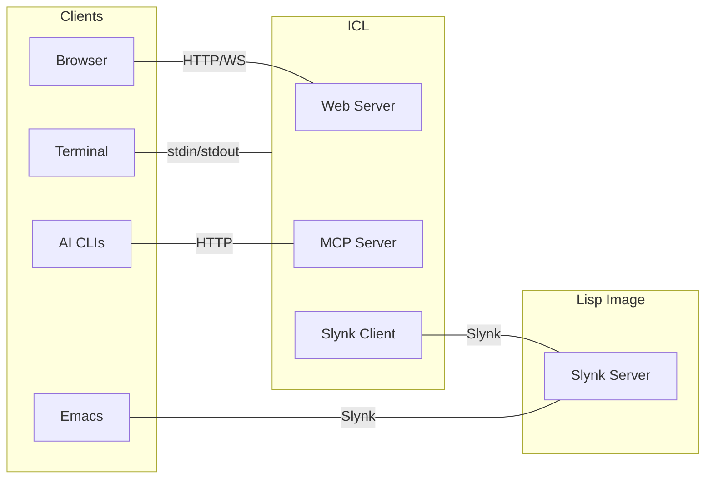

# ICL - Interactive Common Lisp

[](https://github.com/atgreen/icl/actions/workflows/ci.yaml)
[](https://github.com/atgreen/icl/releases/latest)
[](https://opensource.org/licenses/MIT)
[](https://github.com/atgreen/icl/releases)

ICL is an enhanced REPL for Common Lisp. It provides a modern interactive experience with readline-style editing, persistent history, tab completion, and an extensible command system. ICL works in your terminal, in a web browser with package browsing and data visualization, or integrated with Emacs via SLY/SLIME.

## Terminal REPL

<p align="center">
  
</p>

*Syntax highlighting, paren matching, tab completion, paredit mode, and interactive inspector*

## Browser REPL

<p align="center">
  
</p>

*Package browser, symbol inspector, data visualization, and class hierarchy graphs*

## Flame Graph Profiling

<p align="center">
  
</p>

*Interactive Speedscope flame graphs for performance profiling (SBCL only)*

Profile any expression with `,flame` and explore the results in an interactive [Speedscope](https://www.speedscope.app/) visualization. Switch between Time Order, Left Heavy, and Sandwich views to identify performance bottlenecks.

## Emacs Integration

<p align="center">
  
</p>

*Synchronized browser visualization with SLY/SLIME - updates on C-x C-e, C-c C-c, and REPL input*

## Features

- **Syntax highlighting** - Colorized input with distinct colors for keywords, strings, comments, numbers, and symbols
- **Parenthesis matching** - Real-time highlighting of matching parentheses as you type
- **Paredit mode** - Structural editing with auto-close parens, safe deletion, and sexp navigation
- **Multi-line input** - Automatically detects incomplete expressions with smart indentation
- **Persistent history** - Command history saved across sessions
- **Tab completion** - Complete symbols, package-qualified names, and keywords
- **Command system** - Built-in commands prefixed with comma (e.g., `,help`)
- **Multiple Lisp support** - Works with SBCL, CCL, ECL, CLISP, ABCL, Clasp, and Roswell
- **Error backtraces** - Automatic backtrace capture with `,bt` command to view stack traces
- **Thread inspection** - List and inspect threads in the inferior Lisp
- **Documentation lookup** - Quick access to function docs and apropos search
- **Interactive object inspector** - TUI for exploring objects with keyboard navigation
- **Tracing** - Enable/disable function tracing
- **Source location** - Find where functions are defined
- **Terminal-aware colors** - Automatically detects light/dark terminal background
- **AI integration** - Use `,explain` to get AI-powered explanations of code, errors, and results
- **Browser interface** - Web UI with package browser, symbol list, inspector, and xterm.js terminal
- **Data visualization** - Visualize hash tables, classes, sets, SVG, HTML, JSON, Vega-Lite charts, Mermaid diagrams, regex railroad diagrams, and function disassembly
- **Custom visualizations** - Define `icl-runtime:visualize` methods for your own classes
- **Flame graph profiling** - Interactive Speedscope visualizations for performance analysis (SBCL)
- **Code coverage** - HTML coverage reports via sb-cover (SBCL)
- **Emacs integration** - Works with SLY/SLIME for synchronized browser visualization

## Installation

### Fedora / RPM-based Systems

Add the ICL repository and install:
```sh
sudo dnf config-manager addrepo --from-repofile=https://atgreen.github.io/icl/rpm-repo/icl.repo
sudo dnf install icl
```

The RPM packages are GPG-signed. The signing key is imported automatically by dnf on first install.

### Debian / Ubuntu

Add the ICL repository and install:
```sh
curl -fsSL https://atgreen.github.io/icl/deb-repo/icl-archive-keyring.gpg | sudo tee /usr/share/keyrings/icl-archive-keyring.asc > /dev/null
echo "deb [signed-by=/usr/share/keyrings/icl-archive-keyring.asc] https://atgreen.github.io/icl/deb-repo stable main" | sudo tee /etc/apt/sources.list.d/icl.list
sudo apt update
sudo apt install icl
```

The DEB packages are GPG-signed. The signing key is imported in the first step above.

### Pre-built Binaries

Download from [GitHub Releases](https://github.com/atgreen/icl/releases):

| Platform | Formats |
|----------|---------|
| Linux | RPM, DEB, tarball |
| macOS | tarball (arm64, amd64) |
| Windows | ZIP, EXE installer, MSI installer, Chocolatey |

[Roswell](https://roswell.github.io/) users can also install with `ros install atgreen/icl`.

### Building from Source

```sh
git clone https://github.com/atgreen/icl.git
cd icl
ocicl install
make
```

Requires SBCL, [ocicl](https://github.com/ocicl/ocicl), and libfixposix-devel.

## Usage

Start ICL (auto-detects available Lisp):
```sh
icl
```

Specify a Lisp implementation:
```sh
icl --lisp ccl
icl --lisp ecl
icl --lisp roswell  # Use Roswell's managed environment
```

Evaluate an expression and exit:
```sh
icl -e '(+ 1 2 3)'
```

Load a file before starting the REPL:
```sh
icl -l init.lisp
```

Connect to an existing Slynk server:
```sh
icl --connect localhost:4005
```

Skip loading config file:
```sh
icl --no-config
```

Start with browser interface (opens IDE alongside terminal REPL):
```sh
icl -b
```

## Emacs Integration

ICL ships an Emacs helper for SLY or SLIME that launches the browser REPL and
syncs visualizations with evals.

Minimal setup (adjust the path for your install):
```elisp
(add-to-list 'load-path "/path/to/icl/emacs")
(require 'icl)
```

Commands:
- `M-x icl` — start ICL browser connected to the current SLY/SLIME session
- `M-x icl-stop` — stop the ICL process
- `M-x icl-restart` — restart ICL

If you have both SLY and SLIME installed, ICL prefers SLY by default.
You can override this:
```elisp
(setq icl-backend 'slime)  ;; or 'sly or 'auto
```

If you install the package via RPM/DEB/Windows installer, the Emacs
files are placed in a standard site-lisp directory and you can just
`(require 'icl)`.

### Packaging Notes (RPM/DEB/Windows)

Suggested install locations for Emacs files:
- RPM: `%{_datadir}/emacs/site-lisp/icl/icl.el` and `icl-autoloads.el`
- DEB: `/usr/share/emacs/site-lisp/icl/icl.el` and `icl-autoloads.el`
- Windows: `<INSTALL>/share/emacs/site-lisp/icl/icl.el` and `icl-autoloads.el`

For packaging, include `icl-autoloads.el` and add the site-lisp path to
Emacs’ `load-path` (via site-start.d or the installer), then users can:
```elisp
(require 'icl)
```

## Commands

Commands are prefixed with a comma. Type `,help` for a full list.

### Navigation

| Command | Description |
|---------|-------------|
| `,cd <package>` | Change current package |
| `,pwd` | Show current package |
| `,ls [filter]` | List symbols (filters: functions, macros, variables, classes) |

### Documentation

| Command | Description |
|---------|-------------|
| `,doc <symbol>` | Show documentation |
| `,describe <symbol>` | Full description of symbol |
| `,apropos <pattern>` | Search for matching symbols |
| `,arglist <function>` | Show function arguments |
| `,source <symbol>` | View source in Monaco editor panel |
| `,edit <symbol>` | Open source in `$EDITOR` (alias: `,ed`) |

### Cross-Reference (Xref)

| Command | Description |
|---------|-------------|
| `,callers <symbol>` | Show functions that call symbol (alias: `,xc`) |
| `,callees <symbol>` | Show functions called by symbol (alias: `,xe`) |
| `,references <symbol>` | Show code that references variable (alias: `,xr`) |

### Inspection

| Command | Description |
|---------|-------------|
| `,inspect <expr>` | Interactive object inspector (alias: `,i`) |
| `,i` | Inspect last result (`*`) |
| `,inspect-static <expr>` | Non-interactive inspection output |
| `,slots <expr>` | Show slots of a class instance |

The interactive inspector (`,i` or `,inspect`) provides a TUI for exploring objects:

| Key | Action |
|-----|--------|
| `↑`/`↓` or `j`/`k` | Navigate entries |
| `Enter` | Drill into selected entry |
| `b` or `Backspace` | Go back to parent object |
| `q` or `Escape` | Quit inspector |

### Macros

| Command | Description |
|---------|-------------|
| `,macroexpand <form>` | Expand macro once |
| `,macroexpand-all <form>` | Fully expand all macros |

### Development

| Command | Description |
|---------|-------------|
| `,load-system <name>` | Load system via ocicl/Quicklisp/ASDF (alias: `,ql`) |
| `,libyear` | Show dependency freshness metric (requires ocicl) |
| `,changes [system]` | Show LLM-generated changelogs (requires ocicl) |
| `,time <form>` | Time expression evaluation |
| `,load <file>` | Load a Lisp file |
| `,compile-file <file>` | Compile a file |
| `,disassemble <fn>` | Disassemble a function |

### Debugging

| Command | Description |
|---------|-------------|
| `,bt` | Show backtrace from last error |
| `,step <form>` | Show traced function calls during evaluation |
| `,threads` | List all threads in inferior Lisp |
| `,trace <function>` | Enable tracing |
| `,untrace <function>` | Disable tracing |
| `,untrace-all` | Disable all tracing |

### Profiling (SBCL only)

| Command | Description |
|---------|-------------|
| `,profile <form>` | Profile a form with the statistical profiler |
| `,profile-start` | Start ongoing profiling |
| `,profile-stop` | Stop profiling and show results |
| `,profile-reset` | Reset profiler data |
| `,flame <form>` | Profile and show interactive flame graph in browser |
| `,cover-ql <system>` | Load system with code coverage instrumentation |
| `,cover-load <path>` | Load file with code coverage instrumentation |
| `,cover-report` | Generate and display HTML coverage report |
| `,cover-reset` | Clear all coverage data |

The `,flame` command (aliases: `,flamegraph`, `,fg`) profiles the expression and opens an interactive [Speedscope](https://www.speedscope.app/) flame graph in the browser. Requires browser mode (`,browser` or `icl -b`).

The `,cover-*` commands use SBCL's [sb-cover](https://www.sbcl.org/manual/#sb_002dcover) for code coverage analysis. Load code with `,cover-ql` or `,cover-load`, run your tests, then `,cover-report` to view coverage in a Monaco editor panel with expression-level highlighting:
- **Green** - Executed code
- **Red** - Not executed
- **Yellow** - Partial branch coverage (only one branch taken)

Aliases: `,cql` for `,cover-ql`, `,cl` for `,cover-load`.

### Source Viewer

The `,source` command opens a Monaco editor panel in the browser with:
- **Common Lisp syntax highlighting** - Keywords, special variables, constants, and lambda list markers
- **Hover documentation** - Hold mouse over any symbol to see its arglist and docstring
- **Multiple definitions** - Dropdown selector when a symbol has multiple definitions (e.g., function and compiler-macro)
- **Send to REPL** - Right-click → "Send Top-Level Form to REPL" or press Ctrl+Enter
- **Search** - Right-click → "Find..." or Ctrl+F when editor has focus

The Symbol Info panel also includes a **[Source]** link next to [Inspect] for functions, providing quick access to source code.

### Browser Visualization

| Command | Description |
|---------|-------------|
| `,browser` | Start browser-based IDE interface |
| `,viz <expr>` | Visualize data in browser (class hierarchies, hash-tables, images, JSON, and more) |

The `,viz` command automatically detects the type and displays an appropriate visualization:
- **Class names**: `'standard-object` → interactive class hierarchy graph with slots
- **Hash-tables**: `*my-ht*` → key-value table
- **FSet collections**: sets, maps, and bags with appropriate displays
- **JSON strings**: `"{\"key\": \"value\"}"` → syntax-highlighted, pretty-printed JSON
- **Image byte arrays**: PNG, JPEG, GIF, WebP data → displayed inline
- **SVG strings**: `"<svg>...</svg>"` → rendered SVG graphics
- **HTML strings**: `"<!DOCTYPE html>..."` → rendered in sandboxed iframe
- **Functions**: `#'mapcar` → disassembly output with theme-aware styling

#### Venn Diagrams for FSet Sets

Visualize one or more [FSet](https://github.com/slburson/fset) sets as Venn diagrams:

```lisp
,viz *fruits*                    ; Single set as circle with members
,viz *fruits* *red-things*       ; Two-set Venn diagram showing overlap
,viz *set-a* *set-b* *set-c*     ; Three-set Venn diagram
```

- **Single set**: Circle displaying members inside
- **Two sets**: Classic Venn diagram with left-only, intersection, and right-only regions
- **Three sets**: Triangle arrangement showing all 7 regions with counts

Venn diagrams automatically refresh after each REPL evaluation to reflect data changes.

#### Class Hierarchy Graph

The class hierarchy graph supports interactive exploration:
- **Click a node** to see available subclasses and add them one at a time
- **Hover over a node** to highlight all ancestor classes up to the root
- **Drag to pan**, scroll to zoom the graph

#### Images

Visualize image data stored in byte arrays:

```lisp
;; Load an image file into a byte vector
(defvar *img* (alexandria:read-file-into-byte-vector #P"photo.png"))
,viz *img*
```

Supported formats (detected by magic bytes): PNG, JPEG, GIF, WebP.

#### JSON and Code

JSON strings are automatically pretty-printed with syntax highlighting:

```lisp
(defvar *data* "{\"name\": \"Alice\", \"scores\": [95, 87, 92]}")
,viz *data*
```

All visualization panels auto-refresh after REPL evaluations.

#### Custom Visualizations

Define methods on `icl-runtime:visualize` to create custom visualizations for your own classes:

```lisp
;; Visualize a game board as HTML
(defmethod icl-runtime:visualize ((obj my-game-state))
  (list :html (render-board-html obj)))

;; Visualize data as SVG chart
(defmethod icl-runtime:visualize ((obj my-data-series))
  (list :svg (generate-chart-svg obj)))

;; Visualize config as JSON
(defmethod icl-runtime:visualize ((obj my-config))
  (list :json (serialize-to-json obj)))

;; Visualize metrics as Vega-Lite bar chart
(defmethod icl-runtime:visualize ((obj my-metrics))
  (list :vega-lite
        (format nil "{\"$schema\":\"https://vega.github.io/schema/vega-lite/v6.json\",
                      \"data\":{\"values\":~A},
                      \"mark\":\"bar\",
                      \"encoding\":{\"x\":{\"field\":\"name\",\"type\":\"nominal\"},
                                    \"y\":{\"field\":\"value\",\"type\":\"quantitative\"}}}"
                (metrics-to-json obj))))
```

Supported visualization types:
- `(:html string)` - Render HTML in sandboxed iframe
- `(:svg string)` - Render SVG graphics
- `(:json string)` - Syntax-highlighted JSON
- `(:vega-lite spec-string)` - Render [Vega-Lite](https://vega.github.io/vega-lite/) chart
- `(:mermaid definition-string)` - Render [Mermaid](https://mermaid.js.org/) diagram
- `(:regexp pattern-string)` - Render regex railroad diagram via [Regulex](https://jex.im/regulex/)
- `(:image-base64 mime-type base64-string)` - Image from base64 data

Return `NIL` from your method to fall back to ICL's built-in type detection.

See `examples/vega.lisp` for Vega-Lite, `examples/mermaid.lisp` for Mermaid diagrams, and `examples/regexp.lisp` for regex visualization.

#### Library Integration

Libraries can provide visualizations that work even when loaded before ICL connects (e.g., when attaching ICL to a running Lisp from Emacs). Define a `REGISTER-ICL-VIZ` function in your package:

```lisp
(in-package :my-library)

(defun register-icl-viz ()
  "Called by ICL to register visualizations for this library."
  (defmethod icl-runtime:visualize ((obj my-data-structure))
    (list :mermaid (my-struct-to-mermaid obj)))
  (defmethod icl-runtime:visualize ((obj my-config))
    (list :json (config-to-json obj))))
```

ICL automatically discovers and calls `REGISTER-ICL-VIZ` in all packages when `,viz` is invoked. The `icl-runtime` package is guaranteed to exist when your function is called. Each package is only processed once per session.

#### Security

Custom visualizations are protected with multiple layers of security:

| Type | Security Measures |
|------|-------------------|
| **HTML** | Sanitized server-side (scripts and event handlers removed), rendered in sandboxed iframe |
| **Mermaid** | Rendered in strict mode (click handlers and JavaScript disabled) |
| **Vega-Lite** | Expression functions disabled, AST-based evaluation only |
| **SVG** | Protected by CSP (inline scripts and event handlers blocked) |

The browser interface also enforces:
- **Content Security Policy (CSP)** - Blocks inline scripts and restricts resource loading
- **WebSocket origin validation** - Only accepts connections from localhost
- **X-Frame-Options: DENY** - Prevents clickjacking

These protections ensure that loading untrusted Lisp libraries with custom `visualize` methods cannot execute arbitrary JavaScript in your browser.

To disable these restrictions (for trusted code that requires JavaScript in visualizations), use:
```bash
icl -b --unsafe-visualizations
```

### Configuration

| Command | Description |
|---------|-------------|
| `,show-config` | Show config file location and customization options |
| `,reload-config` | Reload config file |
| `,paredit [on/off]` | Toggle paredit structural editing mode |

### Session

| Command | Description |
|---------|-------------|
| `,help` | Show all commands |
| `,info` | Show session information |
| `,history` | Show value history variables |
| `,lisp [name]` | Show or switch Lisp backend |
| `,clear` | Clear terminal |
| `,quit` | Exit ICL |

### AI Integration

| Command | Description |
|---------|-------------|
| `,explain` | Explain last result or error using AI |
| `,explain <code>` | Explain specific code |
| `,ai-cli [name]` | Show or set AI backend (gemini, claude, codex) |

The `,explain` command uses an AI CLI (auto-detected from PATH) to provide explanations of Lisp code, errors, and results. When using Gemini or Claude CLI, ICL provides an MCP server that gives the AI **read-only** access to the live Lisp environment - it can query documentation, describe symbols, and search for functions, but **cannot execute any code**.

Requires one of: [Gemini CLI](https://github.com/google-gemini/gemini-cli), [Claude CLI](https://github.com/anthropics/claude-code), or [Codex CLI](https://github.com/openai/codex)

## History Variables

ICL maintains history of recent values and inputs:

| Variable | Description |
|----------|-------------|
| `icl:_` / `icl:icl-*` | Last result |
| `icl:__` / `icl:icl-**` | Second-to-last result |
| `icl:___` / `icl:icl-***` | Third-to-last result |
| `icl:icl-+` | Last input form |
| `icl:icl-/` | Last returned values (all values) |

## Configuration

ICL loads a config file on startup (unless `--no-config` is specified). This file can contain any Common Lisp code.

**Config file locations:**
- **Linux/macOS:** `$XDG_CONFIG_HOME/icl/config.lisp` (default: `~/.config/icl/config.lisp`)
- **Windows:** `%APPDATA%\icl\config.lisp`

**History file locations:**
- **Linux/macOS:** `$XDG_STATE_HOME/icl/history` (default: `~/.local/state/icl/history`)
- **Windows:** `%LOCALAPPDATA%\icl\history`

Use `,show-config` to see the actual paths on your system.

### Configuration Variables

| Variable | Description |
|----------|-------------|
| `*default-lisp*` | Lisp implementation to use (`:sbcl`, `:ccl`, `:ecl`, `:clisp`, `:abcl`, `:clasp`, `:roswell`, `:lispworks`) |
| `*prompt-string*` | Prompt format string (default: `"~A> "`) |
| `*result-prefix*` | Prefix for results (default: `"=> "`) |
| `*colors-enabled*` | Enable syntax coloring (default: `t`) |
| `*history-size*` | Maximum history entries (default: `1000`) |
| `*paredit-mode*` | Enable structural editing (default: `nil`) |
| `*ai-cli*` | AI CLI for `,explain` (`:gemini`, `:claude`, `:codex`, or `:auto`) |

### Customizing Lisp Invocation

Use `configure-lisp` to customize how ICL invokes a Lisp implementation:

```lisp
(icl:configure-lisp impl &key program args eval-arg)
```

- **`:program`** - Path to the executable
- **`:args`** - List of command-line arguments
- **`:eval-arg`** - The eval flag (e.g., `"--eval"`)

### Example Config File

```lisp
;; Use CCL instead of SBCL
(setf icl:*default-lisp* :ccl)

;; Custom SBCL with more memory
(icl:configure-lisp :sbcl
  :program "/opt/sbcl/bin/sbcl"
  :args '("--dynamic-space-size" "8192"))

;; LispWorks: point at your console image binary.
;; The default :args ("-init" "-" "-siteinit" "-") suppress user init files;
;; keep them, or replace with your own startup flags.
(icl:configure-lisp :lispworks
  :program "/Applications/LispWorks 8.0 (64-bit)/LispWorks (64-bit).app/Contents/MacOS/lispworks-8-0-0-amd64-darwin")

;; Enable paredit mode
(setf icl:*paredit-mode* t)

;; Custom prompt
(setf icl:*prompt-string* "λ ~A> ")

;; Load commonly used systems
(asdf:load-system :alexandria)

;; Define custom utilities
(defun reload ()
  (asdf:load-system :my-project :force t))
```

## Keyboard Shortcuts

| Key | Description |
|-----|-------------|
| `Enter` | Submit form if complete, otherwise insert newline |
| `Alt+Enter` | Always insert newline (works in most terminals) |
| `Shift+Enter` | Always insert newline (requires kitty keyboard protocol) |
| `Tab` | Complete symbol or show completion menu |
| `Ctrl+A` / `Home` | Move to beginning of line |
| `Ctrl+E` / `End` | Move to end of line |
| `Ctrl+F` | Forward character |
| `Ctrl+B` | Backward character |
| `Ctrl+N` | Next line (in multi-line input) |
| `Ctrl+P` | Previous line (in multi-line input) |
| `Ctrl+K` | Kill to end of line |
| `Ctrl+O` | Open line (insert newline, cursor stays) |
| `Ctrl+T` | Transpose characters |
| `Ctrl+U` | Clear entire line |
| `Alt+D` | Kill word forward |
| `Alt+Backspace` | Kill word backward |
| `Ctrl+L` | Clear screen |
| `Ctrl+D` | Delete character at cursor, or EOF if line empty (Emacs-style) |
| `Ctrl+Z` | Undo |
| `Ctrl+Y` | Redo |
| `Ctrl+C` | Cancel current input |
| `Ctrl+\` | Suspend process |
| `Ctrl+R` | Reverse history search (substring match) |
| `Ctrl+G` | Cancel search |
| `Up/Down` | Navigate history (on first/last line) or move cursor |
| `Alt+P` | History search backward (prefix match) |
| `Alt+N` | History search forward (prefix match) |
| `Alt+Q` | Reindent current form |
| `Alt+F` | Forward sexp (paredit mode only) |
| `Alt+B` | Backward sexp (paredit mode only) |

**Notes:**
- In paredit mode, Enter only submits when the cursor is at the end of the buffer (allowing multi-line editing of balanced forms)
- Use Alt+Enter in gnome-terminal and most other terminals. Shift+Enter only works in terminals with kitty keyboard protocol support (kitty, WezTerm, Alacritty, etc.).

## Environment Variables

| Variable | Description |
|----------|-------------|
| `ICL_SLYNK_PATH` | Override path to Slynk directory |
| `ICL_ASDF_PATH` | Override path to bundled ASDF (for backends without ASDF) |
| `ICL_BACKGROUND` | Override terminal background detection (`dark` or `light`) |
| `NO_COLOR` | When set to any non-empty value, disables colored output (see [no-color.org](https://no-color.org/)) |

## Supported Lisp Implementations

ICL aims to support multiple Common Lisp implementations. SBCL is the primary development and testing platform.

| Implementation | Status |
|---------------|--------|
| SBCL | Tested |
| CCL | Tested |
| ECL | Tested |
| ABCL | Tested |
| Roswell | Tested |
| Clasp | Untested |
| CLISP | Experimental |
| LispWorks | Experimental (override `:program` in `~/.iclrc`) |

## Architecture

ICL operates as a frontend that communicates with a backend Lisp process via the Slynk protocol (from SLY). This architecture allows ICL to work with any Common Lisp implementation, provide consistent features regardless of backend, and connect to remote Lisp processes.



All connections use randomly-assigned ports on localhost. When ICL starts an inferior Lisp, it finds an available port and configures Slynk to listen there. The browser interface (started with `,browser` or `icl -b`) serves a Dockview-based IDE with package browser, symbol list, inspector panels, and class hierarchy visualization. The browser automatically closes when ICL terminates. The MCP server (started on-demand by `,explain`) provides read-only AI tool integration.

## License

MIT License. See LICENSE file for details.

## Author

Anthony Green <green@moxielogic.com>
